# SQL Analysis

This section contains all SQL queries used for data cleaning, KPI calculation, and business analysis of the BlinkIT Grocery dataset.

---

## 1. View Complete Dataset

```sql
SELECT *
FROM blinkit_data;
```

**Purpose:** Verify that the dataset has been imported successfully and inspect the available columns.

---

## 2. Data Cleaning

### Standardize Item Fat Content Values

The `Item_Fat_Content` column contained inconsistent values such as:

* LF
* low fat
* Low Fat
* reg
* Regular

The following query standardizes these values to improve reporting consistency.

```sql
UPDATE blinkit_data
SET Item_Fat_Content =
    CASE
        WHEN Item_Fat_Content IN ('LF', 'low fat')
            THEN 'Low Fat'
        WHEN Item_Fat_Content = 'reg'
            THEN 'Regular'
        ELSE Item_Fat_Content
    END;
```

### Validate Data Cleaning

```sql
SELECT DISTINCT Item_Fat_Content
FROM blinkit_data;
```

---

# KPI Analysis

## 1. Total Sales

**Objective:** Calculate total revenue generated from all items sold.

```sql
SELECT CONCAT(
        CAST(SUM(Sales)/1000000 AS DECIMAL(10,2)),
        'M'
       ) AS Total_Sales_Millions
FROM blinkit_grocery_data;
```
<p align="left">
  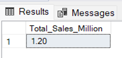
</p>

---

## 2. Average Sales

**Objective:** Calculate average revenue per transaction.

```sql
SELECT CONCAT(
        CAST(AVG(Sales) AS DECIMAL(10,0)),
        'M'
       ) AS Avg_Sales
FROM blinkit_grocery_data;
```
<p align="left">
  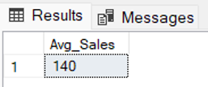
</p>

---

## 3. Number of Items

**Objective:** Count total items sold.

```sql
SELECT COUNT(*) AS Total_No_Items
FROM blinkit_grocery_data;
```
<p align="left">
  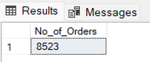
</p>

---

## 4. Average Rating

**Objective:** Measure average customer satisfaction rating.

```sql
SELECT CAST(
        AVG(Rating) AS DECIMAL(10,2)
       ) AS Avg_Rating
FROM blinkit_grocery_data;
```
<p align="left">
  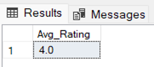
</p>

---

# Granular Business Analysis

## 1. Total Sales by Fat Content

### Objective

Analyze how fat content impacts sales performance and compare additional KPIs across fat content categories.

### Metrics

* Total Sales
* Average Sales
* Number of Items
* Average Rating

```sql
SELECT
    Item_Fat_Content,
    CONCAT(CAST(SUM(Sales)/1000 AS DECIMAL(10,2)), 'k') AS Total_Sales,
    CONCAT(CAST(AVG(Sales) AS DECIMAL(10,0)), 'M') AS Avg_Sales,
    COUNT(*) AS Total_No_Items,
    CAST(AVG(Rating) AS DECIMAL(10,2)) AS Avg_Rating
FROM blinkit_grocery_data
GROUP BY Item_Fat_Content
ORDER BY Total_Sales DESC;
```
<p align="left">
  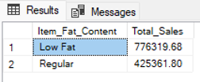
</p>

---

## 2. Total Sales by Item Type

### Objective

Identify top-performing product categories based on sales.

```sql
SELECT
    Item_Type,
    CONCAT(CAST(SUM(Sales)/1000 AS DECIMAL(10,2)), 'k') AS Total_Sales,
    CONCAT(CAST(AVG(Sales) AS DECIMAL(10,0)), 'M') AS Avg_Sales,
    COUNT(*) AS Total_No_Items,
    CAST(AVG(Rating) AS DECIMAL(10,2)) AS Avg_Rating
FROM blinkit_grocery_data
GROUP BY Item_Type
ORDER BY Total_Sales DESC;
```
<p align="left">
  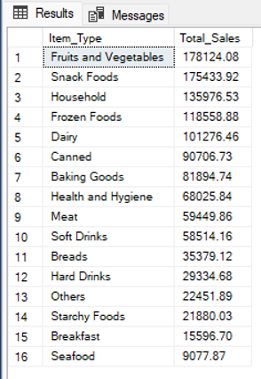
</p>

---

## 3. Fat Content by Outlet for Total Sales

### Objective

Compare sales performance of Low Fat and Regular products across outlet locations.

```sql
SELECT Outlet_Location_Type, 
       ISNULL([Low Fat], 0) AS Low_Fat, 
       ISNULL([Regular], 0) AS Regular
FROM 
(
    SELECT Outlet_Location_Type, Item_Fat_Content, 
           CAST(SUM(Total_Sales) AS DECIMAL(10,2)) AS Total_Sales
    FROM blinkit_data
    GROUP BY Outlet_Location_Type, Item_Fat_Content
) AS SourceTable
PIVOT 
(
    SUM(Total_Sales) 
    FOR Item_Fat_Content IN ([Low Fat], [Regular])
) AS PivotTable
ORDER BY Outlet_Location_Type;
```
<p align="left">
  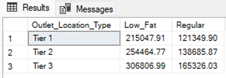
</p>

---

## 4. Total Sales by Outlet Establishment Year

### Objective

Evaluate how outlet age influences revenue generation.

```sql
SELECT
    Outlet_Establishment_Year,
    CONCAT(CAST(SUM(Sales)/1000 AS DECIMAL(10,2)), 'k') AS Total_Sales,
    CONCAT(CAST(AVG(Sales) AS DECIMAL(10,0)), 'M') AS Avg_Sales,
    COUNT(*) AS No_Of_Items
FROM blinkit_grocery_data
GROUP BY Outlet_Establishment_Year
ORDER BY Outlet_Establishment_Year;
```
<p align="left">
  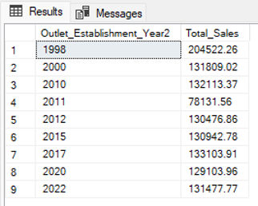
</p>

---

## 5. Percentage of Sales by Outlet Size

### Objective

Determine the contribution of each outlet size toward overall sales.

```sql
SELECT
    Outlet_Size,
    CAST(SUM(Sales) AS DECIMAL(10,2)) AS Total_Sales,
    CAST(
        (SUM(Sales) * 100.0 /
        SUM(SUM(Sales)) OVER())
        AS DECIMAL(10,2)
    ) AS Sales_Percentage
FROM blinkit_grocery_data
GROUP BY Outlet_Size;
```
**Note:** `OVER()` is used as a window function to calculate overall sales while preserving grouped results.
<p align="left">
  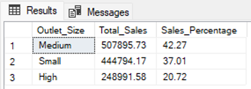
</p>

---

## 6. Sales by Outlet Location

### Objective

Analyze geographical distribution of sales.

```sql
SELECT
    Outlet_Location_Type,
    CAST(SUM(Sales) AS DECIMAL(10,2)) AS Total_Sales,
    CAST(
        (SUM(Sales) * 100.0 /
        SUM(SUM(Sales)) OVER())
        AS DECIMAL(10,2)
    ) AS Sales_Percentage
FROM blinkit_grocery_data
GROUP BY Outlet_Location_Type;
```
<p align="left">
  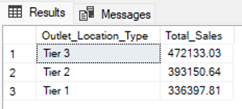
</p>

---

## 7. All KPIs by Outlet Type

### Objective

Compare outlet types across all major business metrics.

### Metrics Included

* Total Sales
* Average Sales
* Number of Items
* Average Rating

```sql
SELECT
    Outlet_Type,
    CONCAT(CAST(SUM(Sales)/1000 AS DECIMAL(10,2)), 'k') AS Total_Sales,
    CONCAT(CAST(AVG(Sales) AS DECIMAL(10,0)), 'M') AS Avg_Sales,
    COUNT(*) AS No_Of_Items,
    CAST(AVG(Rating) AS DECIMAL(10,2)) AS Avg_Rating
FROM blinkit_grocery_data
GROUP BY Outlet_Type
ORDER BY Total_Sales DESC;
```
<p align="left">
  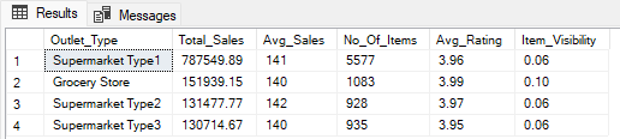
</p>

---

## SQL Skills Demonstrated

* Data Cleaning
* Data Validation
* Aggregate Functions
* GROUP BY Operations
* CASE Statements
* Window Functions
* Business KPI Analysis
* Retail Sales Analytics
* Inventory Performance Analysis
